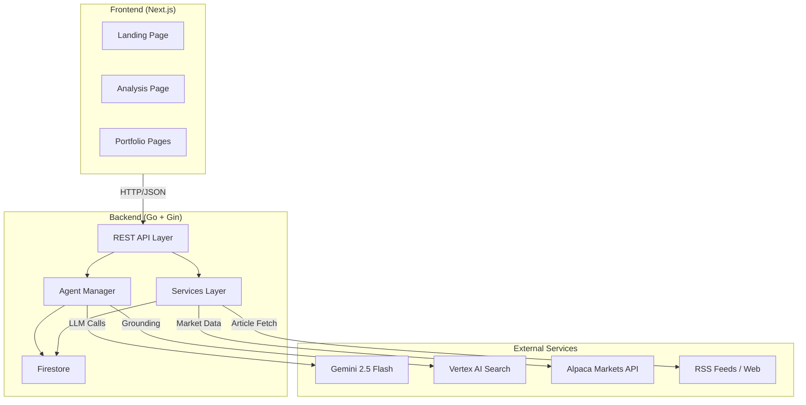
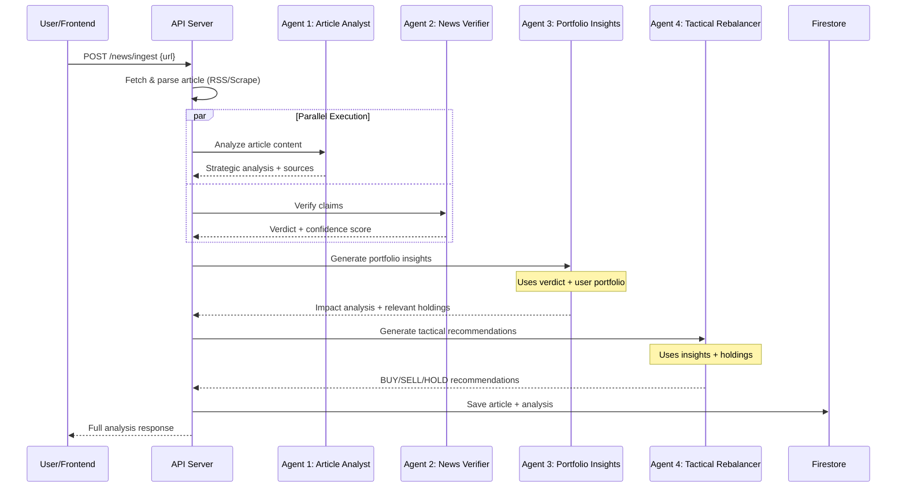
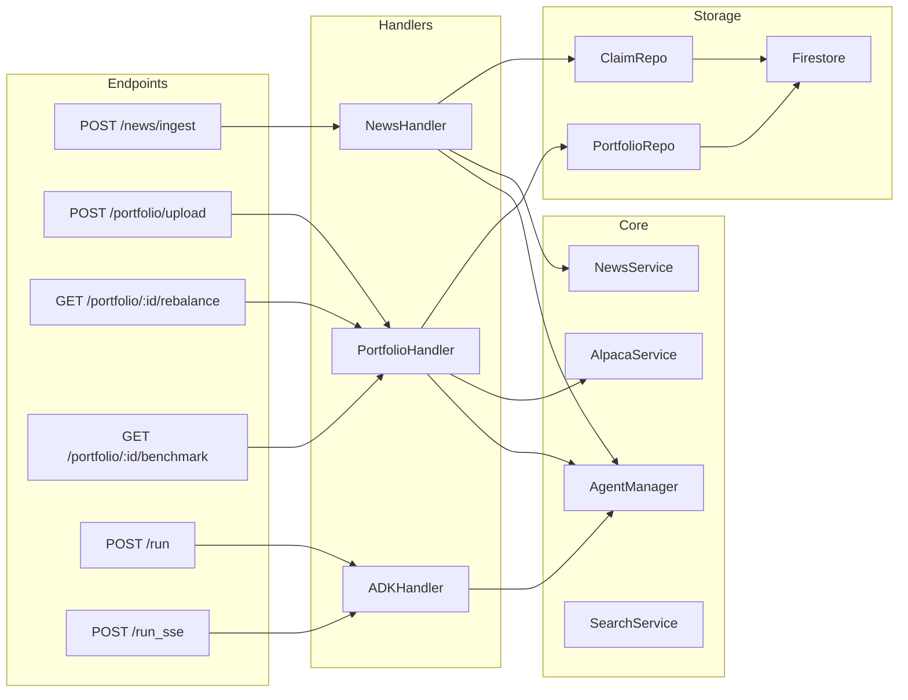
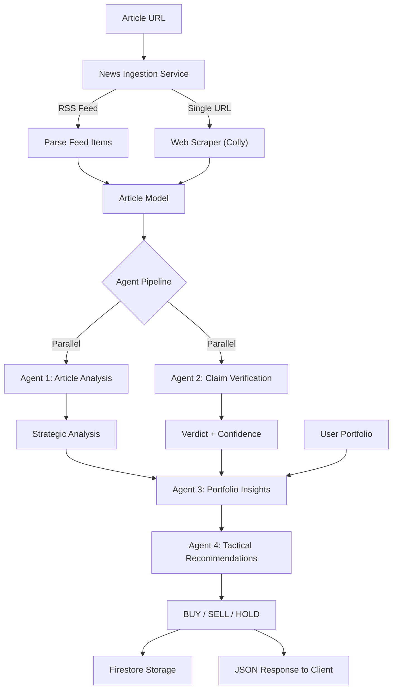

# Fact-Check System Architecture

This document outlines the system architecture, data flow, and multi-agent pipeline used by Fact-Check to verify technology news and generate actionable market insights.

---

## High-Level System Overview



---

## Multi-Agent Verification Pipeline

The core of Fact-Check is a 4-agent pipeline that processes each article through verification, analysis, and recommendation stages.



---

## Agent Descriptions

| Agent | Name | Purpose | Input | Output |
|-------|------|---------|-------|--------|
| 1 | Article Analyst | Strategic analysis of tech news | Article content | Analysis, verified sources, related articles |
| 2 | News Verifier | Fact-checks claims against sources | Article title/claims | Verdict (true/false), confidence score, reasoning |
| 3 | Portfolio Insights | Contextualizes news for user portfolio | Verdict + portfolio holdings | Impact analysis, actionable flag, relevant tickers |
| 4 | Tactical Rebalancer | Generates trading recommendations | Insights + relevant holdings | BUY/SELL/HOLD with quantities and reasoning |

---

## API Architecture



---

## Data Flow



---

## Technology Stack

| Layer | Technology | Purpose |
|-------|-----------|---------|
| Frontend | Next.js 16, React 19, Tailwind CSS 4 | Server-rendered UI with modern styling |
| Backend | Go, Gin Framework | High-performance REST API server |
| AI/ML | Google ADK, Gemini 2.5 Flash | Multi-agent orchestration and LLM inference |
| Search | Vertex AI Search | Grounding agent responses with real sources |
| Database | Cloud Firestore | Document storage for articles and portfolios |
| Market Data | Alpaca Markets API | Real-time stock prices and benchmark data |
| Deployment | Docker, Google Cloud | Containerized deployment |

---

## Project Structure

```
fact-check/
├── client/                    # Next.js frontend
│   ├── src/
│   │   ├── app/               # Pages (analysis, portfolio)
│   │   ├── components/        # Reusable UI components
│   │   └── lib/               # API client
│   └── package.json
├── server/                    # Go backend
│   ├── cmd/
│   │   ├── api/               # Main server entry
│   │   ├── adk_demo/          # Interactive ADK demo
│   │   └── verify_agents/     # Agent verification script
│   ├── internal/
│   │   ├── agents/            # AI agent implementations
│   │   ├── api/               # HTTP handlers
│   │   ├── config/            # Environment configuration
│   │   ├── db/                # Firestore repositories
│   │   ├── models/            # Data models
│   │   └── services/          # External service clients
│   ├── docs/                  # API & setup documentation
│   └── go.mod
├── docs/
│   └── ARCHITECTURE.md        # This file
├── docker-compose.yml
└── README.md
```
